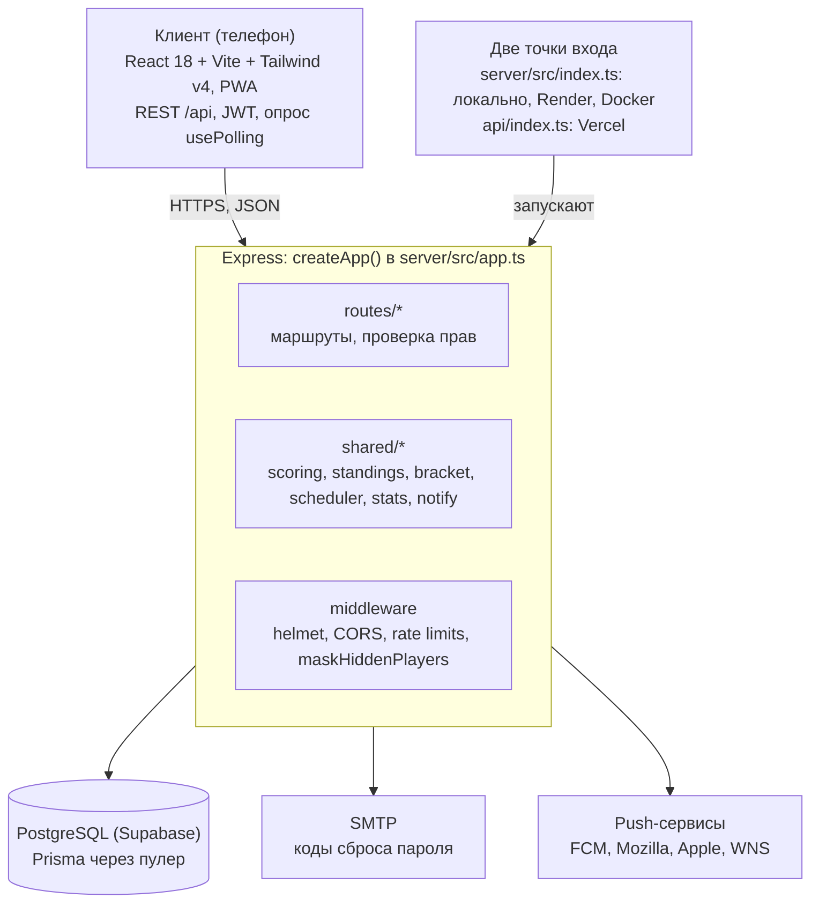

# ТЗ: приложение для клубных вечеров по настольному теннису

Актуально на 2026-10-06. Документ составлен по коду и правилам проекта (`CLAUDE.md`, `.claude/rules/*.md`).

## 1. Общие сведения

Веб-приложение для клубных вечеров по настольному теннису. В нём ведут состав игроков, проводят события (швейцарская система или сетка) и судят матчи прямо у стола. Документ описывает систему как она есть и служит базой для дальнейших изменений.

**Цели**

- Быстро провести клубный вечер: набрать участников, сделать пары, отсудить, получить итоговую таблицу.
- Дать игрокам и зрителям живое табло и результаты с телефона, без регистрации.
- Вести собственный рейтинг игроков по формуле ФНТР.
- Связать события с клубами, бронированием столов и уведомлениями.

**Аудитория**

| Кто | Что делает |
| --- | --- |
| Организатор события | Создаёт событие, утверждает состав, запускает туры, судит |
| Игрок | Записывается на события, сам судит свой матч, смотрит рейтинг и статистику |
| Администратор клуба | Проводит рейтинговые турниры от имени клуба |
| Администратор приложения | Одобряет клубы для рейтинговых турниров |
| Гость | Смотрит публичные страницы, живое табло и результаты |

**Основное устройство — смартфон.** Судейство (`MatchPage`) идёт у стола с телефона, публичные экраны читают с телефона. Все экраны одноколоночные, с нижней панелью вкладок, без таблиц и горизонтальной прокрутки. На десктопе интерфейс просто не должен ломаться.

## 2. Термины и предметная область

Система работает на трёх уровнях: событие → матч → партия. Счёт ведётся партиями, а не очками.

| Термин | Сущность | Смысл |
| --- | --- | --- |
| Событие | `Tournament` | Контейнер: состав, туры, пары, таблица, чат. Вид (`kind`): `TOURNAMENT` (турнир) или `GAME` (игра) |
| Турнир | `kind = TOURNAMENT` | Рейтинговое событие клуба |
| Игра | `kind = GAME` | То же событие, но никогда не меняет рейтинг |
| Матч | `Match` | Два игрока внутри события, счёт по партиям `setsWon1`/`setsWon2` |
| Партия | `MatchSet` | Единица счёта: кто взял, плюс необязательный счёт розыгрышей |
| Тур (раунд) | `Match.round` | Набор пар, созданный одним вызовом `/pair` |
| Свободный тур (bye) | `RoundBye` | Игрок пропускает тур при нечётном числе участников |
| Техническая победа | `/forfeit` | Неявка соперника, без изменения рейтинга |
| Рейтинг | `User.rating` | Собственный рейтинг приложения по формуле ФНТР, старт 100 |

**Форматы события** (`Tournament.format`, меняется только в `DRAFT`):

- `SWISS` (по умолчанию) — швейцарская система, никто не выбывает.
- `KNOCKOUT` — олимпийская система с матчем за 3-е место.
- `PLACEMENT` — сетка без выбывания, разыгрываются все места.

Круговой системы, групп и формата best-of-N нет.

**Жизненный цикл события:** `DRAFT` → `/pair` → `ACTIVE` → `COMPLETED` (автоматически, когда не осталось открытых матчей). Для швейцарки `COMPLETED` не окончателен: новый `/pair` или откат матча возвращают событие в `ACTIVE`. Завершённое событие можно архивировать, но не удалить.

**Жизненный цикл матча:** `NOT_STARTED` → `/start` → `IN_PROGRESS` → `/end` или `/forfeit` → `COMPLETED`. Организатор может вернуть завершённый матч в `IN_PROGRESS`. **Только матчи в статусе `COMPLETED` учитываются** в таблице, статистике и рейтинге.

## 3. Роли и права доступа

Права на события и матчи определяются владением конкретным событием (`Tournament.organizerId`), а не глобальной ролью. Сервер — единственная точка проверки; клиент лишь скрывает недоступные кнопки.

| Действие | Гость | Вошедший | Игрок матча | Организатор события |
| --- | --- | --- | --- | --- |
| Смотреть события, матчи, таблицы, живое табло | да | да | да | да |
| Создать игру (`GAME`), подать заявку на участие | — | да | да | да |
| Изменить `setsToWin` до старта, начать, записать партию, отменить последнюю, завершить матч | — | — | да | да |
| Состав: одобрить, отклонить, добавить, удалить, посев | — | — | — | да |
| Туры: `/pair`, техническая победа, возврат завершённого матча, стол и судья | — | — | — | да |
| Событие: редактировать, архивировать, удалить | — | — | — | да |
| Чат события | — | — | да (`REGISTERED`) | да |

**Рейтинговые события** (`kind = TOURNAMENT`) может создать только администратор клуба события (`ClubAdmin`, их может быть несколько) и только после того, как администратор приложения (`ADMIN`) одобрил клуб (`Club.ratingStatus = APPROVED`). Проверка `canHoldRatedEvent` выполняется при создании события, бронировании и смене клуба у события.

Каждая новая изменяющая операция обязана проверять права на сервере (`loadOwnedTournament`, `loadOwnedMatch`, `loadScorableMatch`).

## 4. Функциональные требования: аккаунт и профиль

Регистрация открытая, с обязательным согласием на обработку персональных данных; аутентификация по JWT.

**4.1. Регистрация и вход**

1. `POST /auth/register` — самостоятельная регистрация. Роль и рейтинг из тела запроса не читаются; стартовый рейтинг 100.
2. Обязательно `acceptTerms: true`; сервер сохраняет `consentAt` и `consentVersion`.
3. Пароли хранятся в виде bcrypt-хеша. Токен — JWT, подписанный `JWT_SECRET`; без секрета сервер не стартует.
4. Лимиты запросов на вход, регистрацию, сброс пароля, демо и запись на событие. Ключ — аккаунт (если есть токен), иначе IP: весь клуб сидит на одном Wi-Fi.

**4.2. Восстановление пароля**

- `/auth/forgot` всегда отвечает 200, не раскрывая, существует ли адрес.
- Код — 6 цифр, хранится хешем, живёт 15 минут, 5 попыток. Один действующий код на пользователя, не чаще одного письма в минуту.
- Демо-адреса код не получают. Без SMTP в продакшене — ответ 503.

**4.3. Профиль**

- Редактирует владелец или `ADMIN`. Рейтинг и роль через профиль не меняются никогда.
- Смена пароля или email требует текущий пароль.
- Публичность имени (`publicProfile`) — отдельное согласие, по умолчанию выключено. Скрытый игрок для гостей показывается как «Скрытый игрок».
- Профиль показывает отдельные счётчики для турниров и игр, статистику и историю матчей.

**4.4. Удаление аккаунта**

`DELETE /auth/me` с паролем анонимизирует аккаунт: строка остаётся как «Удалённый игрок», чтобы не ломать чужие таблицы. Уведомления, чат, подписки, push-подписки, сессии и строки состава без матчей удаляются. Бронирования сохраняются.

**4.5. Страница игрока**

`/player/:id` доступна гостям: публичные данные (без email и телефона), 25 последних матчей, статистика. Любое упоминание игрока в интерфейсе ведёт на эту страницу.

## 5. Функциональные требования: события, швейцарка, сетки

Любой вошедший пользователь создаёт событие и становится его организатором; пары строит сервер по команде организатора.

**5.1. Состав**

- Заявка игрока (`/join`) создаёт строку `PENDING`; организатор одобряет (`REGISTERED`) или отклоняет. Отменённое (`CANCELLED`) событие заявки не принимает.
- Организатор может добавить известных игроков сразу одобренными.
- Игрок без сыгранных матчей удаляется; сыгравший становится `WITHDRAWN` и остаётся в таблице, но не в жеребьёвке.
- `maxPlayers` ограничивает число `REGISTERED` при заявке, добавлении и одобрении. `minRating`/`maxRating` проверяются только при заявке.
- Швейцарка: состав не закрывается, опоздавший входит в следующий тур с нулём побед. Сетки: состав фиксируется после 1-го тура.

**5.2. Жеребьёвка в швейцарке** (`POST /:id/pair`, только организатор)

1. **Тур 1:** по ручному посеву (если задан в `DRAFT`), иначе по рейтингу; пары 1–2, 3–4 и так далее.
2. **Тур 2+:** только когда все матчи текущего тура завершены. Сортировка по победам (при равенстве — по рейтингу), соседние играют друг с другом, повторных встреч по возможности избегают.
3. **Нечётное число:** пропускает игрок с наибольшим числом сыгранных матчей (при равенстве — с меньшим рейтингом). Пропуск хранится в `RoundBye`.
4. Столы распределяются по кругу из `tablesCount`.

**5.3. Сетки** (`KNOCKOUT`, `PLACEMENT`)

- Размер сетки — ближайшая степень двойки. Пустые места достаются верхним посевным, они проходят без игры.
- `KNOCKOUT`: проигравший выбывает, проигравшие полуфиналисты играют за 3-е место.
- `PLACEMENT`: победители играют с победителями, проигравшие — с проигравшими, рекурсивно; разыгрываются места от 1 до N.
- Сетка не хранится: дерево восстанавливается из матчей функцией `computeBracket`. Отображается раунд под раундом, без горизонтальной прокрутки.
- Снятый игрок становится пустым местом; уже назначенный матч против него закрывается технической победой.
- Откат завершённого матча запрещён, если уже создан следующий раунд.

**5.4. Турнирная таблица**

- Место: победы → дополнительный показатель → разница партий. Дополнительный показатель — Бухгольц (по умолчанию) или Зоннеборн–Бергер.
- В сетках сначала место из сетки (делённые места, например 5–8), затем швейцарский порядок внутри делённого места.

**5.5. Завершение, архив, удаление**

- Событие переходит в `COMPLETED` автоматически после расчёта матча, если открытых матчей не осталось. Сетка завершается, только когда разыграны все места.
- Архив (только `COMPLETED`) скрывает событие из ленты, но не из результатов и «Моих».
- Удаление запрещено для `COMPLETED` (рейтинг уже изменён). В остальных случаях удаляются матчи, состав, пропуски и чат, участники получают уведомление.

**5.6. Лента и другое**

- Лента событий: публичные и неархивные; фильтры по городу, клубу, виду, статусу, датам и тексту. Город по умолчанию берётся из профиля.
- Переключатель «Все / Мои»: «Мои» — события, где пользователь организатор или игрок.
- Карточка «Твой матч» на главной показывает открытые матчи игрока; новый тур сопровождается уведомлением и вибрацией.
- Быстрая игра: запись готового результата с соперником одной формой; создаёт завершённую приватную игру.
- Чат события для организатора и утверждённых игроков, минимальный по замыслу.

## 6. Функциональные требования: судейство матча

Судья или сами игроки отмечают, кто взял каждую партию; матч заканчивается только явным действием. Поочкового табло, баланса и перехода подачи нет.

| Операция | Кто | Поведение |
| --- | --- | --- |
| Изменить `setsToWin` | Организатор или игроки | Только до старта; по умолчанию 3, любое число ≥ 1 |
| `/start` | Организатор или игроки | Открывает матч; для `COMPLETED` запрещён |
| `/score { side, score1?, score2? }` | Организатор или игроки | Добавляет партию. Счёт розыгрышей необязателен, оба или ни одного, должен согласовываться с победителем |
| `/undo` | Организатор или игроки | Удаляет последнюю партию, один шаг назад |
| `/end` | Организатор или игроки | Завершает матч. Ничья и матч без партий — отказ 400 |
| `/forfeit { loserSide }` | Организатор | Техническая победа из любого незавершённого состояния, без рейтинга |
| `/undo` на `COMPLETED` | Организатор | Возвращает матч в игру, откатывает ровно сохранённые изменения рейтинга, событие — в `ACTIVE` |
| Стол и судья (`PUT /matches/:id`) | Организатор | — |

**Правила расчёта матча**

1. `setsToWin` — подсказка, а не предел: при достижении подсвечивается «Завершить», продолжать можно.
2. Один расчётчик: `/end` и `/forfeit` сначала захватывают матч (`claimMatch`), параллельный запрос получает 409. Захват снимается через минуту.
3. Рейтинг сначала, затем `COMPLETED` — всё через `finishMatch`. Если финальная запись не удалась, рейтинг откатывается.
4. Ошибки последующих шагов (уведомления, завершение события) логируются, но не возвращаются клиенту.

**Экран судейства (`MatchPage`)**

- Крупный счёт по партиям, две кнопки «партия стороне N», отмена, «Завершить» на всю ширину; чип на каждую партию.
- До старта — компактная история личных встреч.
- Опрос сервера каждые 2 с; все изменения идут через `write()`, чтобы опрос не откатил счёт во время записи.
- Все необратимые действия (завершение, техническая победа, отмена, возврат) — с подтверждением.
- `LiveScore` — публичное живое табло, опрос каждые 2 с.

## 7. Функциональные требования: рейтинг и статистика

Рейтинг — собственный рейтинг приложения по формуле ФНТР (не официальный рейтинг ФНТР), старт 100, считается по партиям и только в турнирах (`kind = TOURNAMENT`). Страница рейтинга обязана об этом сообщать.

**7.1. Формула за одну партию** (Rw — рейтинг победителя партии, Rl — проигравшего, KT — коэффициент турнира):

```
Δ победителя = (100 − (Rw − Rl)) / 10 × KT
Δ проигравшего = −Δ победителя / 2
```

- Если Rw − Rl > 100, обмен за эту партию равен 0.
- Матч = сумма по всем сыгранным партиям; можно проиграть матч и остаться в плюсе.
- KT = `Tournament.ratingWeight`, от 0,1 до 1, по умолчанию 0,5.
- Входные рейтинги фиксируются на начало события (`ratingStart`); сам `User.rating` меняется сразу.
- Округление до 0,01; рейтинг не опускается ниже 0.
- Игры (`GAME`) и технические победы рейтинг не меняют.
- Рейтинг не с нулевой суммой: хранятся оба изменения (`eloDelta` — победителя матча, `eloDeltaLoser` — проигравшего), знак ни у одного не гарантирован.
- Пересчёт всего рейтинга — скрипт `recalc-fntr.sql` (по умолчанию пробный прогон). Формула живёт в двух местах: в коде и в скрипте.

**7.2. Результаты и статистика** (всё считается на лету из завершённых матчей, без кеша)

| Экран или запрос | Содержимое |
| --- | --- |
| «Итоги» (`/results`) | Активные и завершённые события, новые сверху, пьедестал (топ-3), число игроков и идущих матчей |
| «Лидеры» (`/leaders`) | По рейтингу, победам или сыгранным матчам за месяц, год или всё время |
| Рейтинг-лист (`/rating`) | По городу или клубу; без демо и скрытых игроков |
| Статистика игрока | История рейтинга, форма (последние 10), серии, доля побед в матчах, партиях и решающих партиях, лучшая победа, неудобный и удобный соперник, места, достижения |
| Личные встречи (`/h2h`) | На странице игрока и компактно на `MatchPage` до старта |
| Моя статистика (`/profile/stats`) | События, матчи и партии отдельно по турнирам и играм |

## 8. Функциональные требования: клубы, бронирования, уведомления, демо

Бронирования, подписки и чат намеренно минимальны; превращать их в полноценную платформу бронирования и оплаты не требуется.

**8.1. Клубы**

- Клубом управляют его администраторы (`ClubAdmin`, несколько на клуб). Создатель становится первым; последнего администратора удалить нельзя.
- Допуск к рейтинговым турнирам: `NONE` → запрос администратора клуба → `PENDING` → решение `ADMIN` → `APPROVED` или обратно `NONE`. Отзыв одобрения запрещает только новые турниры.
- Страница клуба (доступна гостям): контакты, «Забронировать стол», подписка, статус столов на сегодня, ближайшие события, последние результаты. Для администраторов — список администраторов, редактирование, столы и цены.
- Подписка на клуб (`Subscription`) — единственная связь игрока с клубом, без оплаты.

**8.2. Бронирования**

- Бронь всегда создаёт событие (игру или турнир) в одной транзакции; событие наследует клуб, стол и время. Брони без события не бывает.
- Пересечение с другой бронью того же стола в тот же день — 409. Бронь без стола не конфликтует.
- Отмена брони не трогает событие; удаление события отвязывает бронь.
- Новое публичное событие в клубе уведомляет его подписчиков.

**8.3. Оплата**

- По умолчанию выключена («оплата в клубе»). Тестовый режим `mock` только вне продакшена и только явно. Цены в рублях.

**8.4. Уведомления**

- Входящие в приложении: тип + параметры, текст не хранится и собирается на клиенте из i18n. Новый тип требует ключей `ru` и `en`.
- Поводы: заявки и решения по составу, новая пара или пропуск, итог матча и изменение рейтинга, возврат матча, завершение и удаление события, новое событие в клубе, чат, быстрая игра.
- Хранятся 60 дней. Счётчик непрочитанных опрашивается каждые 20 с.
- Web Push — если заданы VAPID-ключи. Принимаются только https-адреса известных push-сервисов (защита от SSRF). Приложение — устанавливаемое PWA; на iPhone push работает только с домашнего экрана.

**8.5. Демо-режим и обучающий тур**

- Демо — настоящий временный аккаунт (24 ч): гость-организатор, спарринг-партнёр и частное событие «Демо-вечер».
- Демо-аккаунты никогда не попадают в списки рядом с настоящими игроками.
- Ссылка-приглашение передаёт место спарринг-партнёра реальному человеку; одно место — один владелец.
- Обучающий тур ведёт по настоящему сценарию организатора: жеребьёвка, матч, партии, завершение. По окончании 1-й тур сбрасывается, учебный матч не учитывается.
- «Закрепить аккаунт» (`/auth/claim`, с согласием) превращает демо в обычный аккаунт с сохранением истории.

## 9. Нефункциональные требования

Интерфейс ориентирован на телефон, весь текст локализован, права проверяются на сервере, персональные данные обрабатываются по 152-ФЗ.

**9.1. Интерфейс**

- Одна колонка, без таблиц и горизонтальной прокрутки; нижняя панель вкладок (для вошедших: Главная, Играть, Клубы, Результаты, Профиль; для гостей: Главная, Игры, Клубы, Результаты, Войти).
- Тёмная тема navy с лаймовым акцентом `#ccff00`; классы стилей только из `lib/ui.ts`; контурные SVG-иконки, без эмодзи.
- Каждое необратимое действие — через диалог подтверждения `useConfirm()`.
- Имена игроков через `playerName(p)` («Иван П.»), даты через `lib/format.ts`.
- Гостевой режим: читающие экраны не делают запросов, требующих входа; кнопки записи ведут на `/login`.

**9.2. Локализация**

- Весь текст через i18n (`t("key")`), языки `ru` (основной) и `en` (запасной). Язык переключается в профиле и передаётся серверу заголовком `X-Lang`.

**9.3. Безопасность**

- Права проверяются на сервере в каждой изменяющей операции. Тела запросов — через Zod-схемы, ошибки — через `publicError` (без текста Prisma).
- helmet, CORS, ограничение размера тела, лимиты запросов.
- Гонки при расчёте матча и возврате его в игру закрыты условными записями.

**9.4. Персональные данные (152-ФЗ)**

- Согласие при регистрации с версией текста; `CONSENT_VERSION` на сервере = `LEGAL_VERSION` на клиенте.
- Страницы `/privacy` и `/terms`; реквизиты оператора задаются переменными окружения.
- Имена скрытых и удалённых игроков для гостей заменяются на сервере (`maskHiddenPlayers`), при ошибке — скрытие.
- Публичные списки игроков фильтруются `listed`, любые списки — `notDemo`.

**9.5. Производительность и надёжность**

| Экран | Интервал опроса |
| --- | --- |
| `MatchPage`, `LiveScore` | 2 с |
| `TournamentPage`, `PublicTournament` | 5 с |
| Карточка «Твой матч» | 10 с |
| Счётчик уведомлений | 20 с |

- Опрос через `usePolling`: следующий запрос после окончания предыдущего, пауза на скрытой вкладке. WebSocket не используется.
- Минимум обращений к БД: вложенные `include` одним SQL (`relationJoins`), независимые записи параллельно, но с ожиданием (serverless замораживается после ответа).
- Каждый новый фильтр по столбцу — с индексом.
- Пулер Postgres не держит многошаговые транзакции (`P1017`), поэтому запись рейтинга и создание демо идут без `$transaction`.

## 10. Архитектура, данные и развёртывание

Один монорепозиторий на npm workspaces: клиент `client/` и сервер `server/`, у API одна реализация и две точки входа.



Клиент общается с сервером только через REST и опрос; WebSocket не используется.

**10.1. Стек**

| Слой | Технологии |
| --- | --- |
| Клиент | React 18, Vite, Tailwind v4, axios, PWA с service worker |
| Сервер | Node.js, Express, TypeScript, Zod, JWT, bcryptjs, web-push |
| Данные | PostgreSQL, Prisma (`relationJoins`) |

**10.2. Основные сущности** (`server/prisma/schema.prisma`)

| Модель | Назначение |
| --- | --- |
| `User` | Аккаунт и участник: рейтинг, город, согласия, демо-флаги, `deletedAt` |
| `Club`, `ClubAdmin`, `ClubTable` | Клуб, его администраторы, столы с ценами; `ratingStatus` |
| `Tournament` | Событие: `kind`, `format`, `organizerId`, настройки (`setsToWin`, `ratingWeight`, `maxPlayers`, рейтинговый диапазон, `tablesCount`) |
| `TournamentUser` | Состав: статус, посев, `ratingStart` |
| `RoundBye` | Кто пропустил тур |
| `Match`, `MatchSet` | Матч (тур, позиция в сетке, стол, счёт, изменения рейтинга) и партии |
| `Booking`, `Subscription` | Бронь стола под событие; подписка на клуб |
| `ChatMessage`, `Notification`, `PushSubscription` | Чат, входящие, push-подписки |
| `PasswordReset`, `AuditLog`, `Session` | Служебные |

Любое изменение схемы меняет три файла: `schema.prisma`, `migration.sql` (идемпотентный, без потери данных) и `migration-reset.sql` (полный сброс). Новый фильтр по столбцу — с индексом во всех трёх.

**10.3. Развёртывание**

| Платформа | Как |
| --- | --- |
| Vercel | Статика `client/dist`, `/api/*` → `api/index.ts`, регион `dub1` рядом с БД Supabase (eu-west-1) |
| Render | `tsc`, затем `node server/dist/index.js`, регион Франкфурт |
| Docker | `docker-compose.yml`: Postgres + приложение из корневого `Dockerfile` |

Обязательные переменные окружения: `DATABASE_URL`, `JWT_SECRET`. Необязательные: `SMTP_*`, `VAPID_*`, `PAYMENT_PROVIDER`, `CLIENT_URL`, `VITE_LEGAL_*`.

## 11. Ограничения и вне рамок

Ниже — то, чего в системе нет намеренно; каждый пункт — отдельная доработка.

- Поочковое табло, баланс, переход подачи, смена сторон.
- Круговая система, группы, best-of-N, парный разряд.
- Ничьи и автоматическое завершение матча по `setsToWin`.
- Официальный рейтинг ФНТР и интеграция с ним. Старт 100, безрейтинговые техпобеды и нижняя граница 0 — решения приложения, а не Положения ФНТР.
- Полноценная оплата бронирований (только выключено или тестовый `mock`).
- Реальное время через WebSocket: `socket.ts` не подключён, перед включением нужны проверка токена и прав.
- Роли `ORGANIZER`, `JUDGE`, `PLAYER`, `VIEWER` существуют в схеме, но ничего не дают; значение имеет только `ADMIN`.
- Автотестов и линтера нет; проверка — сборка `npm run build -w server` и `-w client`.

**Открытые вопросы**

- [ ] Реквизиты оператора персональных данных (`VITE_LEGAL_*`) — заданы ли в продакшене?
- [ ] Нужен ли статус `DISQUALIFIED`: в схеме он есть, но ничто его не выставляет.
- [ ] Удалять ли неиспользуемые столбцы (`serverSide`, `pointsToWin` и др.) и страницу `RatingPage`, на которую нет ссылок?
